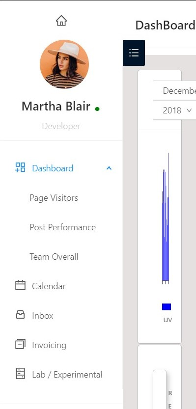
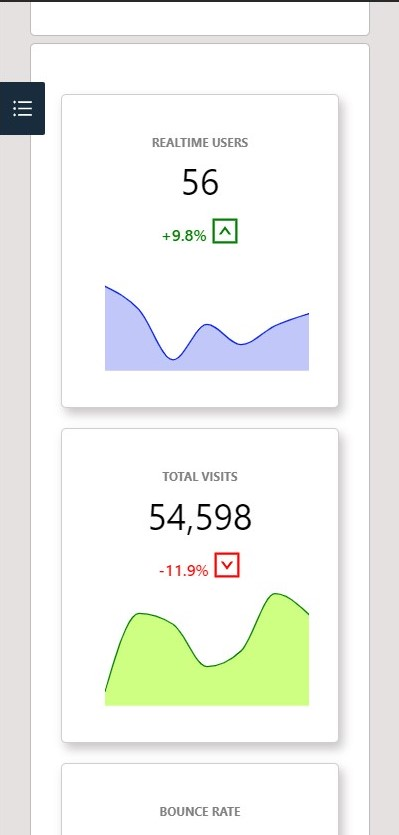

# DashBoard App made using ReactJs 

Dashboard App inspired by the mockup below , made using ReactJS , Completely respoonsive for both tablet and mobile device

### Tech Stack Used :muscle:
- [x] ReactJs 
- [x] Javascript
- [x] ChartJS
- [x] JSON
- [x] Gh-pages

## Working App
<a href="https://avijeetpandey.github.io/dashboard"> **Link of the deployed app** </a>  

### Mockup of the App ( inspired from dribble )
 

### Web View 
**Dashboard** 

 

### Mobile View
**Dashboard-Mobile** 

 

**Charts-Mobile** 

 

### PS It was fun working on the assignment really enjoyed 😃😎